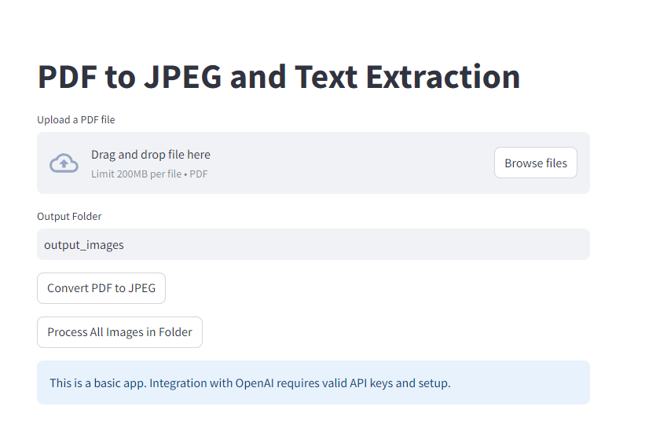

# Script to Extract Data for Land Titles from PDFs
#### Author: George Felobes  
#### Version: 1.0  


### Overview:
This script is designed to process PDF files containing land title information and extract structured data for analysis or record-keeping. It leverages advanced tools such as PyMuPDF for PDF manipulation and OpenAI's API for intelligent data extraction and formatting.

### Features:
- **PDF to Image Conversion:** Converts multi-page PDFs into high-resolution JPEG images for easier processing.
- **Intelligent Data Extraction:** Utilizes OpenAI's language models to extract structured data from images, including text and metadata with confidence scoring.
- **Data Transformation and Storage:** Extracted data is saved in a CSV format, with clearly defined fields and attributes for further use.
- **Cost Estimation:** Calculates the cost in tokens for using OpenAI's API, enabling budget-conscious decision-making.

### Prerequisites:
1. Python 3.8 or above.
2. Required libraries:
   - `fitz` (PyMuPDF)
   - `openai`
   - `pydantic`
   - `Pillow`
3. OpenAI API key with access to the specified model.
4. Input PDF files with standardized formatting for land title information.

### Workflow:
1. **PDF to JPEG Conversion:**  
   Each page of the input PDF is converted into a JPEG image and stored in the specified output folder.
   
2. **Data Extraction from Images:**  
   Images are processed through OpenAI's API to extract structured data, which is validated using a pydantic model for accuracy.

3. **Output as CSV:**  
   Extracted data is stored in a CSV file, with each field representing a key-value pair from the structured data.

4. **Cost Analysis:**  
   Calculates and reports the token cost of processing each image, providing insight into API usage and expenses.

### Use Cases:
- Efficient data processing for legal, real estate, or administrative purposes.
- Automating land title data digitization for record-keeping.
- Reducing manual labor in extracting and formatting land title information.

### Instructions:
1. Place the PDF files to be processed in the designated input folder.
2. Run the script in the Jupyter Notebook environment.
3. Review the extracted CSV files and cost analysis for accuracy and budget evaluation.


### Instructions for Running the Streamlit App

1. **Set Up a Virtual Environment:**
   - Create a virtual environment for the project.
   - Activate the virtual environment.

2. **Install Dependencies:**
   - Use the `requirements.txt` file to install the necessary dependencies:
     ```bash
     pip install -r requirements.txt
     ```

3. **Configure Your API Key:**
   - Add your API key as an environment variable in your terminal:
     ```bash
     export OPENAI_API_KEY=your_api_key_here
     ```
   - Alternatively, you can hardcode the API key in the code, but this is a security risk and should be avoided.

4. **Run the Streamlit Application:**



   - Use the following command to launch the app:
     ```bash
     streamlit run app.py
     ```
   - Ensure that this command is executed within the virtual environment where the dependencies are installed.

5. **Additional Notes:**
   - Streamlit must run inside the activated virtual environment to ensure it has access to the required dependencies.


### Disclaimer:
The script assumes a standard formatting structure for the input PDFs. Variations in formatting may require adjustments to the code for optimal performance.
